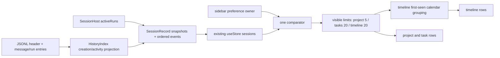

# Assistant previews and sidebar parity

Reference: ZCode `872ad960de7ec172591f7e1952f7849229f94521` (3.14.0), checked out at `/Users/jiezhou/VSCodeProjects/ZCode`. Reference files are read-only. ZPI starts with a clean worktree, Node 24.12.0, npm. This spec precedes tests and implementation.

Implementation and recorded acceptance results: [delivery report, screenshots and limitations](../evidence/preview-sidebar/README.md). The table below records the original acceptance contract; the report maps it to the completed test cases.

## Behavior → implementation → evidence

| Reference behavior / source | ZPI owner / implementation | Acceptance contract |
| --- | --- | --- |
| `ConversationTurnGroup`, `useAssistantPreviewCardsForRow`: join all assistant text in a turn, terminal last text only | `Conversation` RunView projection + injected preview service | Real write/edit tools, streaming/aborted/history, multiple text segments |
| `assistantFileReferences`, `markdownFileLink`, `conversation-preview-artifacts`: exact candidate grammar, path resolution and directive boundaries | Pure UI preview parsing, no filesystem access | Table-driven paths/quotes/encoding/Windows/citations tests |
| MD/HTML require active turn changes, unique bare filename fallback | Existing Main `getChanges(sessionId, runId)`; in-flight request deduplication scoped to session/run/content | No-change, reverted, ambiguous, failed-read and missing-file cases |
| Localhost URLs, reverse position, normalized deduplication, 15 candidates / 10 validated cards | Pure candidate and validation functions; batch `checkPreviewFiles` IPC | URL matrix, prioritization, limits and delayed validation |
| Cards/OpenSplitButton and final-visible PPTX auto-open | UI cards + existing pane-store / fileAction / native open services | Real BrowserPane/FilePane/OfficePreview/native calls, menus, consumed keys |
| `WorkspaceSidebar`: independent project/timeline and created/updated preferences | One renderer preference store, localStorage with validation | Switch both independently, reload/restart, invalid values |
| `mapSessionSummaryToTaskMeta`, `taskListRowActivity`: activity time and live running authority | Main SessionHost + HistoryIndex; stamped event envelope → existing renderer store | Streaming updates, rename/pin/read stability, restart, stale running |
| `taskListOrdering`: running first, created/id for running, selected time/other time/id for idle | One pure comparator, reused before pagination | Equal-time ties, concurrent running updates |
| Relative time, two row layouts, overflow marquee | SidebarTaskRow + source-equivalent overflow component | Fixed clock, narrow width, hover/focus/touch and themes |
| Workspace page size 5, reset when not visible | Sidebar local limits keyed by project ID | 5/6/10/11, independent projects, collapse/view/remove resets |
| Tasks and timeline page size 20, single-direction more | Separate mounted list owners | 20/21/40/41, end/loading/stale hasMore guards |
| `taskTimelineGroups`: local calendar, language weeks, first-seen group order | Pure grouping after comparator and slice | Midnight/week/month boundaries, zh/en, running + groups |
| Zai theme tokens, file assets and Lucide geometry | Scoped CSS, existing matching assets | Original-source fixture vs ZPI screenshots, computed metrics, build assets |

## Product rules

- Preview extensions: `.md`, `.html`, `.htm`, `.docx`, `.xlsx`, `.pptx`, `.pdf`, `.mp4`, `.mov`, `.webm`, `.m4v`, `.mp3`, `.wav`, `.m4a`, `.ogg`, `.opus`, `.flac`, `.weba`. TXT and images do not become automatic cards.
- The full turn's text blocks are joined with two newlines. Rendering is anchored after its last text block, before message actions. Running turns never show cards. Completed and interrupted/aborted text can show cards; failed replies only qualify when their final text is represented as interrupted by the existing projection.
- Parsing priority: citation directives protect their entire ranges, then Markdown links, file URLs, balanced quoted paths, ordinary paths, shared fallback extraction. Unsupported citation kinds must not leak through generic extraction. An ordinary external HTTP link never becomes a local file or website card.
- Match MD/HTML to actual active changes using normalized full paths; a bare filename may match exactly one changed leaf. Fail closed on change-read errors. Office/PDF/media have no turn-change requirement. File stat always runs in Main and returns only existing regular files.
- Accept only source-supported `http(s)://localhost` / `127.0.0.1` URLs, without credentials and with legal ports. Preserve original HTTP route/query/hash. Do not probe connectivity. Any accepted HTTP preview suppresses HTML-file candidates. A localhost HTML pathname can carry a matching changed path and therefore require stat.
- Candidates are sorted by descending text position, deduplicated by normalized path or URL (root URL slash normalized), capped at 15, batch-validated, then capped at 10. Publish a whole validated snapshot; semantic identity rather than array identity drives requests. Old scope/signature responses never render in a new session.
- Deduplicate concurrent identical requests and keep a mounted row's validated snapshot. Remounting a historical conversation rechecks existence, as the reference validation effect does; completed filesystem checks are not an immutable cache. Deleting a file while its conversation is unmounted must suppress its card on return.
- PPTX auto-open only follows a running → successful completion observed in the currently visible conversation. Cold restored history and interrupted turns do not auto-open. Consume a scope/run/final-visible-PPTX-signature key once. Use ZPI's supported native open path when an embedded format viewer is unavailable.
- Cards: full content width, 12px top gap and inter-card gap; radius 12, 1px card border, padding 12 with right 16; icon container 44×44/radius 6/background; icon 24; title/subtitle 14px at default font, 20px line height, 4px gap; title medium/ellipsis; button 28px high, radius 8. Fade 900ms `cubic-bezier(.16,1,.3,1)`, delay `min(index*36,240)` ms; reduced motion disables it.
- Split button default opens an in-app preview; websites have “在浏览器中打开”. File and Markdown cards reuse the changed-file `OpenFileButton`, including menu styling, placement, busy guards and errors. The menu has “Finder”, “使用默认程序打开”, a separator, “复制绝对路径” and “复制相对路径”. Use the existing fileAction IPC for reveal/default-open/copy actions.
- Sidebar filter lives at the right of the task toolbar, 24px trigger / 14px ListFilter. Menu width 192, end aligned, 2px offset, 8px radius, source shadow and Radix navigation. View: Folder/Clock3; sort: MessageCircleCheck/MessageCirclePlus; trailing Check. No added status filters. ZPI has no grouped/remote/backround-work platform; preserve existing purpose-section reorder and task/project operations.
- Default preferences: project + updated. Persist independently and validate each value. This does not change section collapse preferences.
- `createdAt` is the session header timestamp; `updatedAt` is actual session activity, never read/list time or metadata mutation time. Main owns live running evidence; persisted status alone cannot prove running. Historical activity is derived from JSONL message/run entries, not metadata entries. No parallel metadata write path or synchronization delays.
- Compare idle tasks descending selected timestamp, descending other timestamp, then descending ID via `localeCompare`. Running tasks precede idle, compare descending createdAt then ID only. Pinned tasks keep ZPI's existing membership/order and are excluded from ordinary lists; drafts/archived tasks stay excluded.
- Relative time always reads updatedAt: floor minutes (<1 “刚刚”, <60 “N分”), floor hours (<24 “N小时”), floor days (“N天”). Hover/focus suppresses metadata in favor of actions; touch alone does not suppress metadata. ZPI has no permission/user-question waiting state; queued input is not such an interaction.
- Project pages grow 5 at a time, independently; collapse project / projects section / change view / remove project clears its limit. Sort changes retain project limits. Task and timeline pages grow 20; sort or workspace scope changes reset to 20. Unmounting the section resets its page; do not confuse section collapse with “show less”.
- More button: known more = hasMore OR total > visible count; while loading use known more; settled requires loaded count >= current limit AND known more. ZPI currently returns the entire local list, so total is exact and no additional RPC/page cache is introduced.
- Timeline aggregates visible projects plus unassigned/orphaned tasks. Sort and slice first, then group using selected time. Group order is first encounter, not a second chronological sort. Threshold order: today, yesterday, 2/3 days ago, this week, last week, this month, last month, older. Local midnight; Monday starts zh-CN weeks, Sunday en-US. Tasks section remains flat/default rows. Timeline rows have title + workspace label/time second line.

## State ownership and asynchronous order

```mermaid
sequenceDiagram
  participant Agent
  participant Main as SessionHost / HistoryIndex
  participant Store as Renderer store
  participant Row as Terminal turn / preview cache
  participant Pane as Existing pane-store
  Agent->>Main: text/tool/run events
  Main->>Main: stamp activity, persist message/run facts
  Main->>Store: ordered envelope(seq, activityAt, event)
  Store->>Row: terminal RunView + workspace scope
  Row->>Main: getChanges(session, run) if MD/HTML
  Main-->>Row: actual active changes (or failure)
  Row->>Row: candidates / signature / max 15
  Row->>Main: checkPreviewFiles(session, paths)
  Main-->>Row: batch stat results
  Row->>Row: scope/signature guard, publish max 10
  Row->>Pane: user open OR armed successful PPTX once
  Pane->>Main: read/open via existing IPC
  Note over Row,Pane: session switch invalidates publication; late opens remain scoped to originating task
```



## Reference discrepancies and platform boundaries

- The requested `packages/ui/src/TaskTitleOverflowText.tsx` is actually `packages/ui/src/components/TaskTitleOverflowText.tsx`. It also includes a 1-second hover marquee (40px/s, minimum 6s, 24px repeat gap, 2s pause); replicate it.
- Timeline label is `2 天前` / `3 天前` (with a space). Group order follows first encounter even when running-first puts an older group ahead of today.
- Bare Home-relative prose is intentionally ignored; explicit balanced quote/link/citation handling differs. Preserve source behavior rather than expanding the accepted grammar.
- Source Web remote cards and remote editor targets require platform services absent from ZPI. There is no remote execution or background-work orchestration to copy.
- ZPI already previews DOCX/XLSX/media and uses BrowserPane for HTML/PDF. PPTX currently lacks an embedded viewer; preserve the requested native-open boundary and document the platform-dependent visible result.

## Verification plan

1. Focused Vitest: parsing/validation; ordering/preferences/pagination/calendar; Main activity and IPC filesystem validation. Include errors and races, not only snapshots.
2. Playwright: real fake-provider tool calls and actual temp files; history/restart; menu keyboard and default/native/browser actions; independent pagination and preference persistence.
3. Fixed clock/data, 1200×800 window, 280px sidebar, 14px UI and 100% zoom. Compare original reference components or their actual source-rendered fixtures against ZPI in Zai light/dark. Save source SHA, fixture context, screenshots, computed geometry and image diff. Explicitly distinguish fixture rendering from a full running ZCode installation.
4. `npm run check`, corresponding unit and desktop tests, `npm run build`, packaged/base-path asset verification. Record actual results and any limitations; no claim of perfect parity without evidence.

## Follow-up: expand/collapse all project groups

- Keep the toolbar's existing “项目” label unchanged pending design discussion.
- Follow `WorkspaceSidebar.handleToggleAllTaskGroups` and `tabStore` at the same reference SHA: show the 24px toggle beside the label only in project view with at least one project; use 14px Minimize2 / Maximize2 and “收起全部” / “展开全部” tooltips.
- “收起全部” applies only when the projects section and every visible project are expanded. It collapses that section and all its project groups. Otherwise “展开全部” opens the section and every visible project. Leave tasks, pinned items, and non-visible project preferences untouched.
- The existing interface preferences remain authoritative. One `updatePreferences` IPC call writes `projectsCollapsed` and `collapsedProjectIds` together; Main persists, the returned settings replace the existing renderer settings, and the existing visible-project effect resets pagination for collapsed groups. No extra state or delayed synchronization.
- Acceptance: all-expanded → collapse all; partially collapsed → expand all; section collapsed → expand all; no projects/timeline → hidden; tasks/pinned unchanged; settings restored on restart. This follow-up uses static checks only as requested; prior screenshots/test results predate this addition.

## Trial: current-view dropdown capsule

- Baseline saved in commit `223b4b1` before this trial. Replace only the plain toolbar label with a 28px rounded capsule: Folder + “按项目” + ChevronDown, or Clock3 + “时间线” + ChevronDown.
- Clicking the capsule opens the existing radio-menu UI with only the two view choices, aligned to its left edge. Reuse `TaskViewMenu` and the existing `taskPreferences` owner; keep sort selection intact. The right filter/sort menu retains its current contents.
- Keep the expand/collapse control beside the capsule, subject to its existing project-view visibility rules. Keyboard behavior and dismissal use the existing Radix menu. No new persistence or IPC path.
- This trial remains uncommitted for user review. Per request, do not run tests, builds or visual comparisons; previous evidence describes the saved baseline, not this new capsule.

## Follow-up: capsule tooltip and focus appearance

- Remove the capsule's hover tooltip while retaining its accessible name and normal menu behavior. Keep the icon-only filter button's existing tooltip.
- Reference `styles.css:115–134` globally suppresses focus outlines/shadows. ZPI's former 2px global focus-visible outline and local focus rings explain the persistent gray halo after menu focus restoration.
- Remove those outline/shadow rings, including the changed-file pseudo-element and settings-switch sibling rings. Clear Tailwind focus-ring layers without deleting ordinary menu/dialog elevation shadows. Preserve DOM focus, keyboard navigation, highlighted menu items and normal input border states; do not blur controls or use delayed focus changes.
- Continue the user's requested implementation-only workflow: no tests/build/visual rerun for this follow-up.

## Follow-up: sidebar control hints

- Reference remains `872ad960de7ec172591f7e1952f7849229f94521`: `ControlHintTooltip`, `components/ui/tooltip`, `TaskListItem`, `workspace-grouped-tasks/task-row-action-button`, and `WorkspaceSidebar`.
- Reuse ZPI's Radix `ActionHint` with a control appearance: top/center, 2px offset, zero opening delay, Portal rendering and Radix collision handling. Keep message-action hints unchanged and the view capsule without a tooltip or chevron.
- Match the simple source hint: 8px radius, 1px theme border, 10px horizontal / 4px vertical padding, 12px text at the default UI size, 1.5 line height, medium label, 8px gap, maximum width `min(28rem, 100vw - 1rem)`. Use existing matching light/dark tooltip tokens, no arrow and no shadow. Preserve the source animation selectors: delayed/open entry fades and scales from .95 with an 8px side-dependent slide; closed exit fades/scales over 150ms. Instant-open follows the reference's actual Radix state rather than adding an entry animation.
- Apply to “置顶任务”, “取消置顶任务”, “归档任务”, “筛选和排序”, “展开全部”, and “收起全部” in pinned, project, task and timeline rows. Remove native `title` hints to prevent duplicate/system tooltips. Retain ZPI's existing disabled-state reasons and guards; wrap the archive trigger as in the source so its disabled reason remains hoverable. Archive uses the same 14px Lucide asset as the source.
- State owner / event order: pointer enters or keyboard focuses trigger → Radix opens the hint → Portal positions it; leave, blur, Escape or activation → Radix closes it. No application state, IPC or timer is added. Existing task and preference handlers remain authoritative.
- Acceptance mapping: source control dimensions/colors → shared control appearance; source top placement/dismissal → existing Radix tooltip; source row/toolbar labels → their actual buttons; source icons → existing Lucide assets. Inspect the scoped diff; continue the user's implementation-only workflow without tests/builds or a new visual comparison. Prior evidence does not validate this follow-up.

## Follow-up: workbench hint audit

Use the same reference SHA and shared control appearance, without keyboard-shortcut badges. Preserve triggers, icons, focus restoration and actual actions; `asChild` must not introduce layout wrappers. Tooltip visibility is owned by Radix; existing composer/menu state may suppress a hint while its panel is open. No IPC or application-state duplication.

| ZCode source / behavior | ZPI mapping / acceptance |
| --- | --- |
| `ChatPromptActionMenu`: add hint, top | Composer plus: source label, disappear when the add panel opens; file/attachment selection unchanged |
| `ModelConfigSelect` / `modelTriggerDisplay`: full model label, top | Combined model/reasoning selector: provider/model display name from existing selection, no cwd or shortcut; selection and composer focus restoration unchanged |
| `ConversationComposer`: send/enqueue/stop, top | Actual send mode labels; remove stop shortcut badge and its obsolete special padding |
| `WorkspaceSidebarFooter`: settings, top | Footer settings trigger, including collapsed sidebar |
| `SettingsPage` / provider `Navigation`: navigation hints, right | Return to workspace, settings categories and provider list; retain sortable refs/listeners |
| `ProviderTemplatePicker` / `InlineEditableProviderCard`: card and switch hints, top | Provider cards show their names; switch says “启用供应商” / “禁用供应商” according to its real state |
| `DesktopTopOverlayActionButton`: sidebar toggle/new task, bottom | Window chrome: “切换侧边栏” / “新建任务” |
| `WorkspaceSidePaneToggleButton`: panel toggle, bottom | Right toggle: “切换面板”; retain expanded-state accessible name |
| `WorkspaceSidebar` / `WorkspaceSidebarItem`: add project, more, new task, top | Section and project actions; replace native titles with the shared hint |
| `ConversationQueuePanel`: drag/edit/remove, top | Queue actions keep sortable refs/listeners, text-only “立即” stays without a hint |
| `EmbeddedBrowserPaneParts`: back/forward/reload, top | Browser actions get source labels; retain ZPI's stop-loading capability with its actual action label |

The reference's main new-task text button, task-header more trigger and side-pane add-tab/close triggers have no control hint: do not blanket-wrap every button; remove ZPI's native task-menu/add-tab titles to match that absence. Keep rich context usage, file-path/title and settings-specific information separate from simple action hints. ZPI has a combined model/reasoning selector and a browser stop action; do not copy unrelated ZCode platform or selector architecture just to add hints. Update the existing stop-hover assertions for the requested absence of shortcut badges and shared padding. Run static checks only, following the user's existing no-test request; this audit is not a new pixel-comparison result.

## Follow-up: project label and pagination spacing

- Reference `WorkspaceSidebarItem.workspaceLabelContent` gives both folder and project label `text-foreground-subtle`, including expanded/hovered projects; its inner label does not inherit the trigger's stronger foreground. Remove ZPI's later project-title foreground override and use the existing matching subtle token.
- Reference `TaskList` places “显示更多” immediately after the task list with 34px left padding and no extra margin. Its outer div inherits the 16px / 24px root text strut, while its inline label uses 14px / 21px at the default UI setting. Preserve that outer line box in project pagination while keeping ZPI's accessible button. Keep the 32px task rows and 2px gaps unchanged; do not add a guessed task-sized spacer.
- Keep the source wording “显示更多”, the five-at-a-time project limit and existing per-project state/handlers. No state, IPC or event changes.
- Acceptance: compare computed project label color and fifth-task/show-more text positions against the source CSS/markup in standards mode, at default font size, in both themes. This focused rendering inspection does not run the broader test suite or desktop build.
- Focused inspection passed in both themes: project color matches (`foreground-subtle` at 60%); task text and “显示更多” text x/y positions match with 0px delta, and the pagination line box is 24px in both. The inline label retains unitless 1.5 line height so it follows the UI font setting. Local static-DOM screenshots and measurements are in `release/project-spacing-parity/`; these verify the two scoped details, not the full running desktop application.
